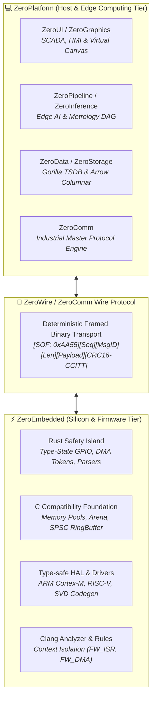

# 🌌 ZeroUniverse: Sovereign Industrial Computing Ecosystem

[](LICENSE)
[-orange.svg)]()
[]()
[]()

**ZeroUniverse** is a sovereign, end-to-end industrial automation and computing ecosystem spanning from bare-metal microcontrollers (MCUs) to high-performance edge gateways, machine vision systems, and hardware-accelerated SCADA/HMI management suites.

---

## 🏛️ Ecosystem Architecture & Operational Tiers

ZeroUniverse strictly segregates operational domains, decoupling deterministic, hard real-time silicon execution from high-level data aggregation and visual telemetry:



---

## 📦 Primary Ecosystem Tiers & Repositories

| Tier | Repository | Tech Stack | Core Capabilities |
| :--- | :--- | :--- | :--- |
| **Host & Edge** | **[`kzxl/ZeroPlatform`](https://github.com/kzxl/ZeroPlatform)** | **100% Pure C#**<br/>*(.NET 8.0, 4.6.2, Standard 2.0)* | 12 sovereign subsystems: HMI/SCADA controls (`ZeroUI`), Direct3D 11 rendering (`ZeroGraphics`), ONNX inference (`ZeroInference`), TSDB storage (`ZeroStorage`), and DAG pipelines (`ZeroPipeline`). |
| **Silicon & Firmware** | **[`kzxl/ZeroEmbedded`](https://github.com/kzxl/ZeroEmbedded)** | **Hybrid C99/C11 + Rust**<br/>*(Strictly `#![no_std]`, Zero GC/VM)* | Zero-cost memory safety (`fw_span_t`, pool, arena), lockless SPSC queues, Type-State peripheral drivers, DMA ownership tokens, and compile-time ISR context analyzer. |
| **Interconnect** | **`ZeroWire` Protocol** | **Shared C-ABI & C# Engine** | Deterministic binary framing with CRC16-CCITT integrity, sliding-window stream resynchronization, and zero-allocation framing. |

---

## 🔌 Cross-Tier Interconnect: The ZeroWire Protocol

The physical bridge between **ZeroEmbedded** (running on silicon) and **ZeroPlatform** (running on edge industrial PCs) is defined by the **ZeroWire** framing format:

```text
+--------------+--------------+---------------+--------------+----------------------+--------------------+-------------------+
| SOF0 (0xAA)  | SOF1 (0x55)  | Sequence (u8) | MsgID (u8)   | Payload Length (u16) | Payload Data (0..N)| CRC16-CCITT (u16) |
+--------------+--------------+---------------+--------------+----------------------+--------------------+-------------------+
|   1 Byte     |   1 Byte     |    1 Byte     |    1 Byte    |       2 Bytes        |     0..256 Bytes   |      2 Bytes      |
+--------------+--------------+---------------+--------------+----------------------+--------------------+-------------------+
```

- **Robust against Line Noise**: Integrated `fw_zerowire_stream_sync` automatically recovers valid frames across noisy serial channels (RS-485 / CAN-FD).
- **High Throughput**: Validated at **32.03 MB/s** decode bandwidth with under **715 ns** frame processing latency.

---

## ⚡ Performance Highlights Across the Universe

- **Host Tier (`ZeroPlatform`)**: 60 FPS oscilloscope waveforms, 10M+ rows virtual SCADA grid, 1.37 bytes/sample TSDB compression, 719 unit tests passed (100%).
- **Firmware Tier (`ZeroEmbedded`)**: 0.946x zero-cost memory abstraction overhead, 20.96 ns/alloc memory pool with double-free protection, 163.5 Million Ops/sec lock-free SPSC queues, 114 unit tests passed (100%).

---

## 🚀 Quick Start Navigation

### Host Development (.NET)
```bash
cd ZeroPlatform
.\clone-ecosystem.ps1
dotnet build ZeroPlatform.slnx -c Release
dotnet test ZeroPlatform.slnx
```

### Firmware Development (C + Rust)
```bash
cd ZeroEmbedded
# Run hardened unit test suite
cl /nologo /W4 /WX /O2 /I core-c/include core-c/src/*.c tests/test_core_memory.c /Fe:test_hardened.exe
.\test_hardened.exe

# Run benchmark suite
cl /nologo /W4 /O2 /I core-c/include core-c/src/*.c benchmarks/bench_suite.c /Fe:bench_suite.exe
.\bench_suite.exe
```

---

## 📄 Authors & License

Architected and developed by **Phong Võ** (`kzxl`). Released under the permissive **MIT License**.
