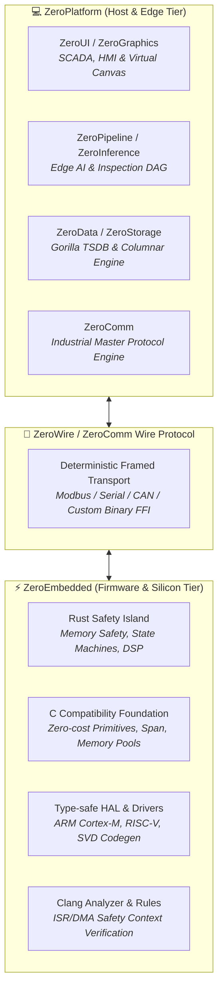

# 🌌 ZeroUniverse: Sovereign Industrial Computing Ecosystem

[-orange.svg)]()

**ZeroUniverse** is a sovereign, end-to-end industrial automation and computing ecosystem spanning from bare-metal microcontrollers (MCUs) to high-performance edge computing gateways, industrial vision systems, and SCADA/HMI management suites.

---

## 🏛️ Ecosystem Architecture & Tiers

ZeroUniverse is engineered with a **strict separation of operational domains**, decoupling deterministic hard real-time MCU execution from high-level data aggregation and user interface layers.

---

## 📦 Core Subsystems

### 1. [ZeroPlatform](file:///e:/15.%20Other/ZeroUniverse/ZeroPlatform) (The Sovereign .NET Industrial Suite)
- **Tech Stack**: 100% Pure C# (.NET 8.0, .NET Framework 4.6.2, .NET Standard 2.0).
- **Core Pillars**: 12 modular subsystems (ZeroTensor, ZeroCompute, ZeroData, ZeroStorage, ZeroInference, ZeroNeural, ZeroSignal, ZeroGeometry, ZeroComm, ZeroGraphics, ZeroUI, ZeroPipeline).
- **Domain**: Edge AI, computer vision, analytical SDF cards, 60 FPS oscilloscope waveforms, 10M+ row virtual grid, time-series storage.

### 2. [ZeroEmbedded](file:///e:/15.%20Other/ZeroUniverse/ZeroEmbedded) (Hybrid C + Rust Embedded Framework & Toolchain)
- **Tech Stack**: Hybrid C99/C11 Foundation + Rust (`#![no_std]`) + LLVM/Clang Tooling.
- **Core Pillars**:
  - Zero-cost memory safety primitives (`fw_span_t`, memory pool, arena, ownership).
  - Rust safety island for complex protocols, algorithms, and state machines.
  - Clang static analysis passes for ISR context validation and DMA buffer lifetime enforcement.
  - CMSIS-SVD-driven type-safe HAL generator.
- **Domain**: Microcontrollers (ARM Cortex-M, RISC-V, AVR), bare-metal, RTOS adapters (FreeRTOS, Zephyr).

---

## 🚀 Quick Navigation

- **Host Development (.NET)**: Navigate to [`ZeroPlatform/`](file:///e:/15.%20Other/ZeroUniverse/ZeroPlatform) and open `ZeroPlatform.slnx`.
- **Firmware Development (C/Rust)**: Navigate to [`ZeroEmbedded/`](file:///e:/15.%20Other/ZeroUniverse/ZeroEmbedded) to explore the Core C primitives and Rust safety crates.

---

## 📄 Licensing & Governance

All platforms and libraries within the **ZeroUniverse** ecosystem are authored and architected by **Phong Võ** (`kzxl`) and released under the permissive **MIT License**.
