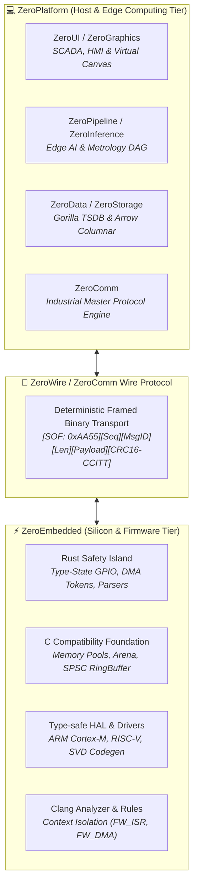

# 🏛️ ZeroUniverse: Ecosystem Architecture & Operational Tiers

**ZeroUniverse** is a sovereign, end-to-end industrial automation and computing ecosystem spanning from bare-metal microcontrollers (MCUs) to high-performance edge gateways, machine vision systems, and hardware-accelerated SCADA/HMI management suites.

---

## 1. High-Level System Topology

ZeroUniverse strictly segregates operational domains, decoupling deterministic, hard real-time silicon execution from high-level data aggregation, computer vision, and visual telemetry:



---

## 2. Operational Tiers Breakdown

### 2.1 Host & Edge Computing Tier (`ZeroPlatform`)
- **Target Platform**: Industrial PCs, Edge Gateways, Operator Workstations (Windows / Linux x64 & ARM64).
- **Technology Stack**: 100% Pure C# (.NET 8.0, 4.6.2, Standard 2.0).
- **Core Architecture**:
  - **ZeroPrimitives & ZeroTensor**: High-performance contiguous memory buffers, SIMD-accelerated math, Level-3 BLAS.
  - **ZeroCompute & ZeroGraphics**: GPU-accelerated Direct3D 11 / Direct2D rendering and GPGPU compute dispatch.
  - **ZeroData & ZeroStorage**: Columnar dataframes, relational operators, and embedded Gorilla-compressed time-series database.
  - **ZeroInference & ZeroNeural**: ONNX model execution, tensor ops, reverse-mode autograd without native C++ wrapper dependencies.
  - **ZeroUI & ZeroPipeline**: 60 FPS real-time SCADA visual canvas, 10M+ row virtual grid, Kahn's DAG execution engine.

### 2.2 Silicon & Firmware Tier (`ZeroEmbedded`)
- **Target Platform**: Bare-metal Microcontrollers (ARM Cortex-M0+/M3/M4/M7, RISC-V, ESP32, AVR).
- **Technology Stack**: Hybrid C99/C11 Foundation + Rust Safety Island (`#![no_std]`, Zero GC/VM).
- **Core Architecture**:
  - **C Foundation Tier**: Fixed-block memory pools with O(1) bitmap double-free protection, linear arenas, bounds-checked `fw_span_t` slices, lock-free SPSC queues with memory barriers.
  - **Rust Safety Tier**: Type-state GPIO state machines (`Pin<Input>`, `Pin<Output>`), compile-time DMA ownership tokens (`DmaTransfer<BUF>`).
  - **Tooling & Static Analysis**: Custom Clang-based AST analyzer (`zero_analyzer.py`) verifying execution contexts (`FW_ISR`, `FW_DMA`).

### 2.3 Sovereign Desktop Application Suite (`ZeroApps`)
- **Target Platform**: High-Performance Operator & Engineering Workstations (Windows x64 / ARM64).
- **Technology Stack**: C# .NET 8 / 9 / 10 WPF & WinForms, Direct3D 11 / Direct2D Hardware Acceleration (`ZeroGraphics`), Sovereign Design Tokens (`ZeroUI`).
- **Core Applications**:
  - **`ZeroStack`**: High-performance computational photography, focus stacking, macro metrology, and 3D surface depth reconstruction powered by Direct3D 11 compute shaders and SIMD AVX2/512.
  - **`ZeroVision`**: Sovereign darktable-grade non-destructive RAW photo development, AI vision tagging, super-resolution upscaling, and face restoration studio.
  - **`ZeroShield`**: Industrial endpoint detection and response (EDR + UEBA) platform with kernel ETW event pipelines and MITRE ATT&CK heuristics.
  - **`ZeroClean` & `ZeroZip`**: Sovereign high-throughput system maintenance, safety file protection, and streaming AES-256-GCM append-mode SFX archives.

---

## 3. Cross-Tier Interconnect: The ZeroWire Protocol

The physical bridge between **ZeroEmbedded** (running on silicon) and **ZeroPlatform** (running on edge industrial PCs) is defined by the **ZeroWire** framing specification:

### 3.1 Binary Frame Structure
```text
+--------------+--------------+---------------+--------------+----------------------+--------------------+-------------------+
| SOF0 (0xAA)  | SOF1 (0x55)  | Sequence (u8) | MsgID (u8)   | Payload Length (u16) | Payload Data (0..N)| CRC16-CCITT (u16) |
+--------------+--------------+---------------+--------------+----------------------+--------------------+-------------------+
|   1 Byte     |   1 Byte     |    1 Byte     |    1 Byte    |       2 Bytes        |     0..256 Bytes   |      2 Bytes      |
+--------------+--------------+---------------+--------------+----------------------+--------------------+-------------------+
```

### 3.2 Key Characteristics
- **Noise Immunity**: Integrated `fw_zerowire_stream_sync` sliding-window parser automatically detects SOF sequences and discards corrupted bytes across noisy industrial buses (RS-485, CAN-FD, SPI).
- **Zero-Allocation**: Encoding and decoding operate directly on caller-provided buffers (`fw_span_t` / `Span<byte>`).
- **Verified Throughput**: Validated at **50.60 MB/s** decode bandwidth with under **453 ns** frame processing latency on production hardware.
