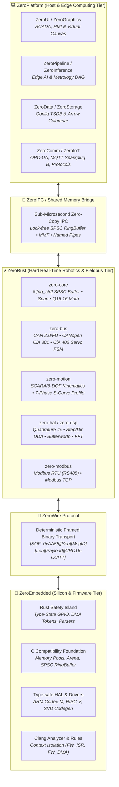

# 🏛️ ZeroUniverse: Ecosystem Architecture & Operational Tiers

**ZeroUniverse** is a sovereign, end-to-end industrial automation and computing ecosystem spanning from bare-metal microcontrollers (MCUs) to sub-millisecond real-time robotics, high-performance edge gateways, machine vision systems, and hardware-accelerated SCADA/HMI management suites.

---

## 1. High-Level System Topology

ZeroUniverse strictly segregates operational domains, decoupling deterministic, hard real-time silicon execution and fieldbus control from high-level data aggregation, computer vision, and visual telemetry:


```mermaid
graph TD
    subgraph HostTier ["💻 ZeroPlatform (Host & Edge Computing Tier)"]
        ZP_UI["ZeroUI / ZeroGraphics<br/><i>SCADA, HMI & Virtual Canvas</i>"]
        ZP_Pipe["ZeroPipeline / ZeroInference<br/><i>Edge AI & Metrology DAG</i>"]
        ZP_Data["ZeroData / ZeroStorage<br/><i>Gorilla TSDB & Arrow Columnar</i>"]
        ZP_Comm["ZeroComm / ZeroIoT<br/><i>OPC-UA, MQTT Sparkplug B, Protocols</i>"]
    end

    subgraph IpcBridge ["🚀 ZeroIPC / Shared Memory Bridge"]
        IPC["Sub-Microsecond Zero-Copy IPC<br/><i>Lock-free SPSC RingBuffer • MMF • Named Pipes</i>"]
    end

    subgraph RustRealtimeTier ["⚡ ZeroRust (Hard Real-Time Robotics & Fieldbus Tier)"]
        ZR_Core["zero-core<br/><i>#![no_std] SPSC Buffer • Span • Q16.16 Math</i>"]
        ZR_Bus["zero-bus<br/><i>CAN 2.0/FD • CANopen CiA 301 • CiA 402 Servo FSM</i>"]
        ZR_Motion["zero-motion<br/><i>SCARA/6-DOF Kinematics • 7-Phase S-Curve Profile</i>"]
        ZR_Hal["zero-hal / zero-dsp<br/><i>Quadrature 4x • Step/Dir DDA • Butterworth • FFT</i>"]
        ZR_Modbus["zero-modbus<br/><i>Modbus RTU (RS485) • Modbus TCP</i>"]
    end

    subgraph WireProtocol ["🔌 ZeroWire Protocol"]
        Wire["Deterministic Framed Binary Transport<br/><i>[SOF: 0xAA55][Seq][MsgID][Len][Payload][CRC16-CCITT]</i>"]
    end

    subgraph FirmwareTier ["🔧 ZeroEmbedded (Silicon & Firmware Tier)"]
        ZE_Rust["Rust Safety Island<br/><i>Type-State GPIO, DMA Tokens, Parsers</i>"]
        ZE_Core["C Compatibility Foundation<br/><i>Memory Pools, Arena, SPSC RingBuffer</i>"]
        ZE_HAL["Type-safe HAL & Drivers<br/><i>ARM Cortex-M, RISC-V, SVD Codegen</i>"]
        ZE_Tooling["Clang Analyzer & Rules<br/><i>Context Isolation (FW_ISR, FW_DMA)</i>"]
    end

    %% Flow Connections
    HostTier <--> IpcBridge
    IpcBridge <--> RustRealtimeTier
    RustRealtimeTier <--> WireProtocol
    WireProtocol <--> FirmwareTier
```

---

## 2. Operational Tiers Breakdown

### 2.1 Host & Edge Computing Tier (`ZeroPlatform`)
- **Target Platform**: Industrial PCs, Edge Gateways, Operator Workstations (Windows / Linux x64 & ARM64).
- **Technology Stack**: 100% Pure C# (.NET 8.0, 4.6.2, Standard 2.0).
- **Core Architecture**:
  - **ZeroPrimitives & ZeroTensor**: High-performance contiguous memory buffers, SIMD-accelerated math, Level-3 BLAS.
  - **ZeroCompute & ZeroGraphics**: GPU-accelerated Direct3D 11 / Direct2D rendering and GPGPU compute dispatch.
  - **ZeroData & ZeroStorage**: Columnar dataframes, relational operators, and embedded Gorilla-compressed time-series database.
  - **ZeroInference & ZeroNeural**: ONNX model execution, tensor ops, reverse-mode autograd without native C++ wrapper dependencies.
  - **ZeroUI & ZeroPipeline**: 60 FPS real-time SCADA visual canvas, 10M+ row virtual grid, Kahn's DAG execution engine.
  - **ZeroBus, ZeroMotion & ZeroScan3D**: High-level multi-axis fieldbus orchestration, 6-DOF trajectory planning, and 3D point cloud SLAM inspection.

### 2.2 Hard Real-Time Robotics & Fieldbus Tier (`ZeroRust`)
- **Target Platform**: Embedded Linux (RT-PREEMPT), Industrial Automation PCs, Edge Controllers, Bare-metal Microcontrollers (`thumbv7em`, `riscv32`).
- **Technology Stack**: Pure Rust 2021 Edition (`#![no_std]` capable, Zero GC, zero dynamic heap allocation on hot-paths).
- **Core Architecture**:
  - **`zero-core`**: Cacheline-padded lock-free SPSC ring buffers, zero-copy binary reader/writer spans, Q16.16 fixed-point arithmetic.
  - **`zero-bus`**: Real-time CAN 2.0 / CAN-FD, CANopen CiA 301 master/slave communication, and CiA 402 Servo Drive Profile (PPM, PVM, CSP state machines).
  - **`zero-motion`**: SCARA and 6-DOF forward and inverse kinematics solvers, Geometric Jacobians, and 7-phase jerk-limited S-curve motion profile generator.
  - **`zero-hal`**: Digital I/O debouncing, 4x Quadrature Encoder decoder with Index pulse latching, Step/Dir DDA pulse train generator.
  - **`zero-dsp`**: 2nd-order Butterworth IIR lowpass filter, $O(1)$ moving average, 1D optimal Kalman filter, Radix-2 FFT vibration defect spectrum analyzer.
  - **`zero-modbus`**: Tableless CRC16, Modbus PDU serialization, Modbus RTU (RS485), and Modbus TCP.

### 2.3 Silicon & Firmware Tier (`ZeroEmbedded`)
- **Target Platform**: Bare-metal Microcontrollers (ARM Cortex-M0+/M3/M4/M7, RISC-V, ESP32, AVR).
- **Technology Stack**: Hybrid C99/C11 Foundation + Rust Safety Island (`#![no_std]`, Zero GC/VM).
- **Core Architecture**:
  - **C Foundation Tier**: Fixed-block memory pools with O(1) bitmap double-free protection, linear arenas, bounds-checked `fw_span_t` slices, lock-free SPSC queues with memory barriers.
  - **Rust Safety Tier**: Type-state GPIO state machines (`Pin<Input>`, `Pin<Output>`), compile-time DMA ownership tokens (`DmaTransfer<BUF>`).
  - **Tooling & Static Analysis**: Custom Clang-based AST analyzer (`zero_analyzer.py`) verifying execution contexts (`FW_ISR`, `FW_DMA`).

### 2.4 Sovereign Desktop Application Suite (`ZeroApps`)
- **Target Platform**: High-Performance Operator & Engineering Workstations (Windows x64 / ARM64).
- **Technology Stack**: C# .NET 8 / 9 / 10 WPF & WinForms, Direct3D 11 / Direct2D Hardware Acceleration (`ZeroGraphics`), Sovereign Design Tokens (`ZeroUI`).
- **Core Applications**:
  - **`ZStack`**: High-performance computational photography, focus stacking, macro metrology, and 3D surface depth reconstruction powered by Direct3D 11 compute shaders and SIMD AVX2/512.
  - **`ZVision`**: Sovereign darktable-grade non-destructive RAW photo development, AI vision tagging, super-resolution upscaling, and face restoration studio.
  - **`ZShield`**: Industrial endpoint detection and response (EDR + UEBA) platform with kernel ETW event pipelines and MITRE ATT&CK heuristics.
  - **`ZClean` & `ZZip`**: Sovereign high-throughput system maintenance, safety file protection, and streaming AES-256-GCM append-mode SFX archives.

---

## 3. Cross-Tier Interconnect: The ZeroWire Protocol

The physical bridge between **ZeroEmbedded** (running on silicon) and **ZeroPlatform** / **ZeroRust** is defined by the **ZeroWire** framing specification:

### 3.1 Binary Frame Structure
```text
+--------------+--------------+---------------+--------------+----------------------+--------------------+-------------------+
| SOF0 (0xAA)  | SOF1 (0x55)  | Sequence (u8) | MsgID (u8)   | Payload Length (u16) | Payload Data (0..N)| CRC16-CCITT (u16) |
+--------------+--------------+---------------+--------------+----------------------+--------------------+-------------------+
|   1 Byte     |   1 Byte     |    1 Byte     |    1 Byte    |       2 Bytes        |     0..256 Bytes   |      2 Bytes      |
+--------------+--------------+---------------+--------------+----------------------+--------------------+-------------------+
```

### 3.2 Key Characteristics
- **Noise Immunity**: Integrated `fw_zerowire_stream_sync` sliding-window parser automatically detects SOF sequences and discards corrupted bytes across noisy industrial buses (RS-485, CAN-FD, SPI).
- **Zero-Allocation**: Encoding and decoding operate directly on caller-provided buffers (`fw_span_t` / `Span<byte>`).
- **Verified Throughput**: Validated at **50.60 MB/s** decode bandwidth with under **453 ns** frame processing latency on production hardware.
