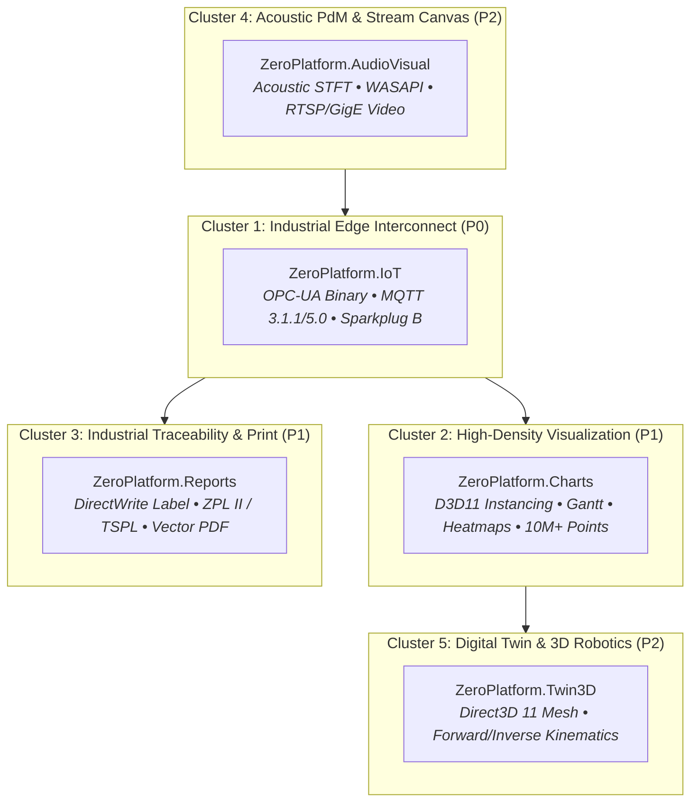

# 🛰️ ZeroUniverse: Satellite Systems Architecture & Expansion Roadmap

> **Standard Compliance**: Standard Technical English • Zero External Dependencies • Multi-Targeting (`.NET 8.0`, `.NET Framework 4.6.2`, `.NET Standard 2.0`, and `#![no_std]` C/Rust).  
> **Status**: Official Ecosystem Specification & Execution Plan  
> **Architect**: Phong Võ (`kzxl`)  

---

## 1. Executive Vision & Architectural Rationale

**ZeroUniverse** is architected as a sovereign industrial computing and automation ecosystem. Rather than bloating the core operational tiers (`ZeroPlatform` Host Tier and `ZeroEmbedded` Firmware Tier), domain-specific and enterprise integration capabilities are factored into **Autonomous Satellite Systems** adhering to the **Multi-Repository Satellite Topology**.

### Core Tenets for Satellite Modules:
1. **Zero External Dependencies**: Every satellite must be implemented in 100% pure language primitives (Pure C# on Host; Pure C99/Rust `#![no_std]` on Firmware) without third-party vendor runtime dependencies.
2. **Decoupled Autonomy**: Each satellite resides in its own isolated repository with dedicated CI/CD, version tags, and package distribution pipelines (`.nupkg` / C-ABI DLL / static library).
3. **High-Throughput Zero-Copy Integration**: Satellites interface with core foundations (`ZeroPrimitives`, `ZeroTensor`, `ZeroData`, `ZeroGraphics`, `ZeroStorage`) via direct memory slicing (`Span<T>`, `Memory<T>`, MMF, VRAM Shared Surfaces) without serialization overhead.

---

## 2. Cluster Breakdown & Phased Execution

The expansion roadmap is organized into **5 Strategic Execution Clusters** prioritized by industrial automation market demands:

---

### 📦 Cluster 1: Industrial Edge Interconnect (`ZeroPlatform.IoT`) — Priority: P0 (Active)

#### 1.1 Objective & Industrial Impact
Bridges the gap between edge automation controllers and enterprise **Unified Namespace (UNS)** architectures. Implements pure C# codecs for **OPC-UA (Binary)** and **MQTT Sparkplug B** to enable real-time telemetry streaming and tag synchronization without third-party licensing.

#### 1.2 Module Structure & Architecture
- **Location**: `ZeroPlatform/Satellites/ZeroPlatform.IoT`
- **Sub-namespaces & Projects**:
  - `ZeroPlatform.IoT.OpcUa`:
    - `UaTcpTransport`: Pure C# asynchronous TCP socket handling UA Connection (`HEL`/`ACK`), Secure Conversation (`OPN`/`CLO`), and Message (`MSG`) framing.
    - `BinaryEncoder` & `BinaryDecoder`: Low-level span-based serialization of OPC-UA primitive types, `NodeId`, `QualifiedName`, `LocalizedText`, and `ExtensionObject`.
    - `OpcUaClient`: Service dispatcher for `ReadRequest`, `WriteRequest`, and `CreateSubscriptionRequest` / `PublishRequest`.
  - `ZeroPlatform.IoT.Mqtt`:
    - `MqttPacketParser`: Zero-allocation streaming parser for MQTT 3.1.1 and 5.0 packets (`CONNECT`, `CONNACK`, `PUBLISH`, `PUBACK`, `SUBSCRIBE`, `SUBACK`, `PINGREQ`).
    - `MqttClient`: Non-blocking TCP/TLS transport supporting QoS 0, 1, and 2 with automatic keep-alive ping and resynchronization.
  - `ZeroPlatform.IoT.SparkplugB`:
    - `SparkplugPayload`: Compact binary Protocol Buffers codec for Sparkplug B metric models (`NBIRTH`, `NDATA`, `DBIRTH`, `DDATA`, `DDEATH`).
    - `SparkplugBridge`: Automatic mapping from `ZeroData.DataFrame` and `ZeroComm` PLC registers into standard Sparkplug B metric sets.
  - `ZeroPlatform.IoT.StorageBridge`:
    - Zero-copy pipeline sink streaming incoming OPC-UA subscriptions and MQTT metrics directly into `ZeroStorage` (Gorilla TSDB) and `ZeroUI` virtual telemetry feeds.

---

### 📊 Cluster 2: High-Density Industrial Visualization (`ZeroPlatform.Charts`) — Priority: P1

#### 2.1 Objective & Industrial Impact
Extends `ZeroGraphics` to deliver specialized, GPU-accelerated 60+ FPS charts capable of handling 10,000,000+ points with real-time zooming, panning, and multi-axis alignment for financial, sensor, and production scheduling analytics.

#### 2.2 Module Structure & Architecture
- **Location**: `ZeroPlatform/Satellites/ZeroPlatform.Charts`
- **Sub-namespaces & Projects**:
  - `ZeroPlatform.Charts.Core`: Data series structures (`LineSeries`, `CandlestickSeries`, `HeatmapSeries`, `GanttSeries`), coordinate space projection, and LTTB/MinMax decimation.
  - `ZeroPlatform.Charts.DirectX`: Direct3D 11 instanced quad shaders for bar/candlestick charts and dynamic `LineStrip` vertex buffers for high-frequency telemetry.
  - `ZeroPlatform.Charts.Controls`: WinForms and WPF user controls featuring crosshairs, legends, axis rulers, and seamless integration with `ZeroUI` dark themes (`#12151C`).

---

### 🏷️ Cluster 3: Industrial Traceability & Compliance (`ZeroPlatform.Reports`) — Priority: P1

#### 3.1 Objective & Industrial Impact
Provides end-to-end industrial document generation, barcode/DataMatrix thermal label formatting, and vector PDF report generation for quality inspection stations (SPC/CPK metrics) without external reporting engines.

#### 3.2 Module Structure & Architecture
- **Location**: `ZeroPlatform/Satellites/ZeroPlatform.Reports`
- **Sub-namespaces & Projects**:
  - `ZeroPlatform.Reports.Vector`: Document layout DOM (pages, tables, metric cards, vector charts) rendered via DirectWrite and Direct2D.
  - `ZeroPlatform.Reports.Labels`: Barcode and 2D DataMatrix label generator utilizing `ZeroGraphics.Vision.Codes`.
  - `ZeroPlatform.Reports.ThermalPrinters`: Native ZPL II (Zebra) and TSPL (TSC) printer command generators transmitting raw binary streams over TCP/USB sockets.
  - `ZeroPlatform.Reports.Pdf`: Zero-dependency vector PDF writer generating self-contained inspection certificates and statistical reports.

---

### 🔊 Cluster 4: Acoustic PdM & Vision Streaming (`ZeroPlatform.AudioVisual`) — Priority: P2

#### 4.1 Objective & Industrial Impact
Merges high-frequency acoustic sensor analysis with multi-camera video streaming for holistic condition-based monitoring and predictive maintenance of rotating machinery.

#### 4.2 Module Structure & Architecture
- **Location**: `ZeroPlatform/Satellites/ZeroPlatform.AudioVisual`
- **Sub-namespaces & Projects**:
  - `ZeroPlatform.AudioVisual.Acoustic`: Windows Audio Session API (WASAPI) and ALSA/Linux capture driver for acoustic telemetry.
  - `ZeroPlatform.AudioVisual.Analysis`: Integration with `ZeroSignal` (STFT Spectrogram, Continuous Wavelet Transform) and `ZeroInference` (Attention Anomaly Detection) for bearing defect diagnosis.
  - `ZeroPlatform.AudioVisual.Video`: Multi-stream RTSP/GigE Vision frame decapsulation with zero-copy Direct3D 11 texture presentation.

---

### 🤖 Cluster 5: Digital Twin & 3D Robotics (`ZeroPlatform.Twin3D`) — Priority: P2

#### 5.1 Objective & Industrial Impact
Provides 3D spatial simulation, robotic arm forward/inverse kinematics, and digital twin synchronization, bridging physical factory sensors with virtual 3D models.

#### 5.2 Module Structure & Architecture
- **Location**: `ZeroPlatform/Satellites/ZeroPlatform.Twin3D`
- **Sub-namespaces & Projects**:
  - `ZeroPlatform.Twin3D.Engine`: Pure C# Direct3D 11 3D scene graph, lighting, camera controls, and STL/OBJ mesh loader.
  - `ZeroPlatform.Twin3D.Kinematics`: Denavit-Hartenberg (DH) parameter solver for 4-axis SCARA and 6-axis articulated robotic arms.
  - `ZeroPlatform.Twin3D.Sync`: Real-time coordinate synchronization binding PLC joint angles and `ZeroGeometry` 3D point cloud inspections into the live 3D twin.

---

## 3. Detailed Master Implementation Matrix

| Cluster | Subsystem | Target Repository | Frameworks | Key Milestones | Dependencies |
| :--- | :--- | :--- | :--- | :--- | :--- |
| **Cluster 1** | **`ZeroPlatform.IoT`** | `kzxl/ZeroPlatform.IoT` | `netstandard2.0;net462;net8.0` | • OPC-UA Binary Codec • MQTT 3.1.1/5.0 Client • Sparkplug B Encoder • Gorilla TSDB Sink Bridge | `ZeroPrimitives`, `ZeroData`, `ZeroStorage` |
| **Cluster 2** | **`ZeroPlatform.Charts`** | `kzxl/ZeroPlatform.Charts` | `net462;net8.0-windows` | • D3D11 Instanced Shader • 10M+ Pts Telemetry Plot • Gantt & Heatmaps • ZeroUI Theme Controls | `ZeroGraphics`, `ZeroUI` |
| **Cluster 3** | **`ZeroPlatform.Reports`** | `kzxl/ZeroPlatform.Reports` | `netstandard2.0;net462;net8.0-windows` | • DirectWrite Document DOM • ZPL II / TSPL Codec • Pure C# Vector PDF Writer • Barcode/QR Embedder | `ZeroGraphics.Vision`, `ZeroData` |
| **Cluster 4** | **`ZeroPlatform.AudioVisual`** | `kzxl/ZeroPlatform.AudioVisual` | `netstandard2.0;net462;net8.0-windows` | • WASAPI Sensor Streamer • Acoustic Spectrogram PdM • RTSP / GigE Vision Canvas | `ZeroSignal`, `ZeroInference`, `ZeroGraphics` |
| **Cluster 5** | **`ZeroPlatform.Twin3D`** | `kzxl/ZeroPlatform.Twin3D` | `net462;net8.0-windows` | • D3D11 Mesh Renderer • 6-Axis Robot Kinematics • Point Cloud Scene Overlay | `ZeroGeometry`, `ZeroGraphics` |

---

## 4. Execution Roadmap & Milestones
- **Phase A (Cluster 1: `ZeroPlatform.IoT`)**: ✅ **COMPLETED** (25/25 Tests Passed)
  - MQTT 3.1.1/5.0 engine, OPC-UA binary protocol stack, Sparkplug B encoder, Gorilla TSDB bridge.
- **Phase B (Cluster 2 & 3: `ZeroPlatform.Charts` & `ZeroPlatform.Reports`)**: ✅ **COMPLETED** (10/10 Tests Passed)
  - `ZeroPlatform.Charts`: LineSeries LTTB decimation, Candle, Heatmap, Gantt, Palette, Instanced vertex, WinForms control.
  - `ZeroPlatform.Reports`: Native ZPL II & TSPL encoders, pure C# Vector PDF 1.4 writer, ReportDocument DOM.
- **Phase C (Cluster 4 & 5: `ZeroPlatform.AudioVisual` & `ZeroPlatform.Twin3D`)**: ✅ **COMPLETED** (11/11 Tests Passed)
  - `ZeroPlatform.AudioVisual`: Real-time acoustic circular ring buffer, PCM WAV codec, STFT Spectrogram engine, bearing defect detector (BPFO/BPFI/BSF/FTF), RTP/H.264 depacketizer.
  - `ZeroPlatform.Twin3D`: Pure C# 3D Math (Vec3, Mat4, Aabb3D), OBJ & Binary STL mesh loader, Denavit-Hartenberg 6-DOF & SCARA kinematics solver (FK + analytical IK), Digital Twin scene graph, and operator safety breach collision detection.
