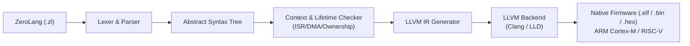

# RFC 001: ZeroLang — Domain-Specific Sovereign Embedded Language (Phase 12)

- **Status**: Draft / Exploratory Architectural Specification
- **Ecosystem**: ZeroUniverse / ZeroEmbedded
- **Target**: Bare-metal MCUs (ARM Cortex-M0/M3/M4/M7, RISC-V RV32I/E, AVR)

---

## 1. Motivation & Problem Statement

Embedded systems software currently faces a painful dilemma:
- **C**: Universal vendor SDK support, maximum performance, but zero memory safety, race conditions, dangling pointers, and unsafe ISR operations.
- **Rust**: Exceptional safety, but heavy toolchain footprint, complex FFI boundaries with vendor SDKs, and steep learning curve for hardware teams.

**ZeroLang** is conceived as a domain-specific systems language designed specifically for deterministic, resource-constrained microcontroller hardware, compiling directly to LLVM IR while leveraging the already-verified **ZeroEmbedded Core C** and **Rust Safety Crates**.

---

## 2. Core Language Pillars

1. **Context-Aware Safety as Language Keywords**:
   ```rust
   // Context keyword blocks invalid operations at compile-time
   isr USART1_Handler() {
       let byte = UART1.read_byte();
       rx_queue.push(byte); // OK: O(1) lock-free queue
       // delay_ms(10);     // COMPILE ERROR: Cannot invoke blocking call inside `isr`
       // alloc(64);        // COMPILE ERROR: Dynamic allocation is illegal inside `isr`
   }
   ```

2. **First-Class Memory Primitives**:
   - `span<u8>`: Built-in safe slice view with zero runtime overhead.
   - `pool<T, N>`: Deterministic O(1) fixed block allocator.
   - `arena<N>`: Bump allocator with automatic scoped rewind at block exit.

3. **Seamless C ABI Interoperability**:
   - Compiles down to standard C calling conventions (`extern "C"`).
   - Can directly include and link existing vendor headers (`stm32f4xx.h`, FreeRTOS `task.h`).

---

## 3. Compilation Pipeline



---

## 4. Relationship with ZeroUniverse

ZeroLang does **not** attempt to reinvent the runtime or HAL from scratch. It directly compiles against the runtime abstractions already perfected in **ZeroEmbedded** (`pool`, `spsc`, `zerowire`, `hal`).
